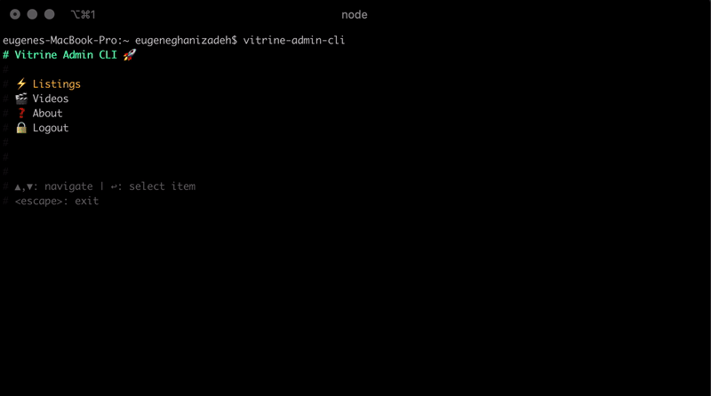

# Admin CLI for Vitrine

A CLI tool to manage Vitrine listings and videos.



## Requirements

You need [Node.js](https://nodejs.org/en/) and [NPM](https://www.npmjs.com) to use this tool.
NPM is automatically installed alongside Node. Make sure you install the proper version of Node, 
in particular you would need `node>12` for this tool to work.

## How to Install

To install, you need to login to Github NPM Registry. If you have 2FA enabled,
you need to [create a personal access token first](https://docs.github.com/en/authentication/keeping-your-account-and-data-secure/creating-a-personal-access-token) and use it instead
of your Github password.

```bash
#
# 👉 step 1: login into Github NPM registry
# NOTE: if you use 2FA, use the personal token instead of your password.
#
npm login --scope=@vitrin-app --registry=https://npm.pkg.github.com
```
```bash
#
# 👉 step 2: configure NPM to use Github registry for @vitrin packages
#
npm config set @vitrin-app:registry https://npm.pkg.github.com
```
```bash
#
# 👉 step 3: install the CLI
# Note: you can also update it with the same command
#
npm i -g @vitrin-app/admin-cli
```

<br>

## How to Run

To use on production:

```bash
vitrine-admin-cli
```

<br>

You can also use the CLI to manage development / staging instances. The CLI accepts environment
variables for configuring API connections, so just provide the environment variables for instances
you want to manage:

```bash
API_LISTS_URL=<dev-listing-url> vitrine-admin-cli
```
```bash
API_AUTH_URL=<dev-auth-url> \
API_VIDEOS_URL=<dev-videos-url> \
API_LISTS_URL=<dev-listing-url> \
vitrine-admin-cli
```

<br><br>